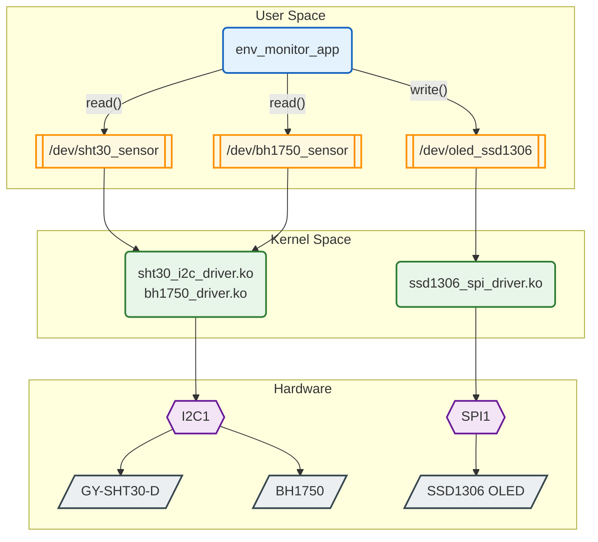

# Environmental Monitoring System

Hệ thống giám sát môi trường trên BeagleBone Black, viết từ đầu toàn bộ stack — Device Tree, kernel driver, ứng dụng user-space và Yocto layer — không dùng thư viện vendor hay driver dựng sẵn.

## Kiến trúc



## Từ Device Tree đến `/dev`

Device node chỉ xuất hiện khi cả chuỗi này khớp nhau:

| # | Bước | Ở đâu |
|---|------|-------|
| 1 | Device Tree khai báo node kèm `compatible = "haidoan,sht30"` | `am335x-boneblack.dts` |
| 2 | Module `.ko` có trong rootfs | recipe `inherit module` |
| 3 | Module được nạp lúc boot | `KERNEL_MODULE_AUTOLOAD` |
| 4 | Kernel khớp `compatible` với `of_match_table` của driver | Driver Model |
| 5 | `probe()` gọi `misc_register()` tạo `/dev/...` | trong driver |

Đứt ở bước 1, 3 hay 4 đều cho **cùng một triệu chứng** — không có device node, và kernel không báo lỗi gì.

## Luồng dữ liệu

```
env_monitor_app (5 giây/lần)
  ├─ read("/dev/sht30_sensor")  → "25.6-68.3"
  ├─ read("/dev/bh1750_sensor") → "123.4"
  └─ write("/dev/oled_ssd1306", "25.6-68.3-123.4")
        └─ driver strsep() theo '-' → vẽ 3 dòng kèm icon lên OLED
```

Giao tiếp app ↔ driver là văn bản thuần qua device file — `cat /dev/sht30_sensor` là thấy ngay số liệu, không cần app.

## Cấu trúc

```
meta-envmon/                            # Yocto layer
├── conf/layer.conf
├── recipes-kernel/
│   ├── linux/
│   │   ├── linux-yocto_%.bbappend      # chèn DT vào am335x-boneblack.dts
│   │   └── files/*.dtsi                # khai báo I2C1 + SPI1 + pinmux
│   ├── bh1750-driver/                  # mỗi driver: 1 recipe + source
│   ├── sht30-driver/
│   └── ssd1306-driver/
├── recipes-apps/env-monitor/
└── recipes-core/images/envmon-image.bb
```

## Kernel driver

Cả ba driver theo chung một khung — khớp thiết bị qua Device Tree, đăng ký device node bằng `miscdevice`:

```c
static const struct of_device_id my_i2c_of_match[] = {
    { .compatible = "haidoan,bh1750" },   // ← khớp chuỗi với Device Tree
    { }
};
MODULE_DEVICE_TABLE(of, my_i2c_of_match);
module_i2c_driver(bh1750_driver);
```

Dùng `miscdevice` thay vì `alloc_chrdev_region` + `cdev_add` + `device_create`: gọn còn một lời gọi `misc_register()`, đổi lại chỉ được một minor mỗi lần đăng ký — đủ vì mỗi loại cảm biến chỉ có một con.

| Driver | Điểm đáng chú ý |
|---|---|
| `sht30_i2c_driver.c` | CRC8 (đa thức `0x31`) xác thực dữ liệu; chuyển đổi bằng số nguyên (milli-độ) vì kernel không dùng FPU |
| `bh1750_driver.c` | One-time H-resolution mode, `msleep(120)` chờ chuyển đổi; trả lux × 10 để giữ một chữ số thập phân |
| `ssd1306_spi_driver.c` | Vẽ trực tiếp qua SPI, không framebuffer; font 8x8 và 3 icon tự viết; chân DC/RESET lấy từ Device Tree |

Viết cho **kernel 6.6** — `probe()` một tham số, `remove()` trả `void`.

## Device Tree

Mỗi bus cần **hai** phần: pinmux (chọn mux mode cho chân) và khai báo thiết bị con.

```dts
&i2c1 {
    status = "okay";                    /* bus mặc định là disabled */
    pinctrl-0 = <&i2c1_pins_sensors>;

    sht30@44 {
        compatible = "haidoan,sht30";   /* ← khớp với driver */
        reg = <0x44>;                   /* địa chỉ I2C */
    };
};
```

Device Tree được nhập thẳng vào `am335x-boneblack.dts` lúc build kernel (không dùng overlay `.dtbo`), qua `linux-yocto_%.bbappend`:

```bash
FILESEXTRAPATHS:prepend := "${THISDIR}/files:"
SRC_URI += "file://envmon-i2c1-sensors.dtsi file://envmon-spi1-oled.dtsi"

do_configure:prepend() {
    dts_dir="${S}/arch/arm/boot/dts/ti/omap"    # kernel 6.x dời DTS của TI vào đây
    install -m 0644 ${WORKDIR}/*.dtsi ${dts_dir}/
    # nối #include vào cuối am335x-boneblack.dts
}
```

`FILESEXTRAPATHS:prepend` bắt buộc phải có — thiếu nó BitBake tìm `.dtsi` trong thư mục của recipe gốc trong `poky/` và không thấy.

## Yocto layer

`meta-envmon` không sửa gì trong `poky/` — chỉ thêm recipe mới (`.bb`) và sửa recipe có sẵn (`.bbappend`).

| Phần | Cơ chế | Kết quả |
|------|--------|---------|
| Kernel module | `inherit module` | `.ko` → `/lib/modules/<ver>/extra/` |
| App | `do_install` + `${bindir}` | binary → `/usr/bin/` |
| Device Tree | `.bbappend` lên `linux-yocto` | node vào `am335x-boneblack.dts` trước khi build kernel |

```bash
inherit module
SRC_URI = "file://Makefile file://bh1750_driver.c"
KERNEL_MODULE_AUTOLOAD += "bh1750_driver"    # nạp module lúc boot
```

`module.bbclass` truyền `KERNEL_SRC` trỏ vào kernel đã build, nên Makefile driver không hardcode đường dẫn kernel.

Yocto **scarthgap** (5.0), `MACHINE = "beaglebone-yocto"`, kernel 6.6.

## Phần cứng

| Thành phần | Giao tiếp | Chân |
|-----------|-----------|------|
| GY-SHT30-D | I2C1 `0x44` | P9_24 (SCL), P9_26 (SDA) |
| BH1750 | I2C1 `0x23` | P9_24 (SCL), P9_26 (SDA) |
| SSD1306 | SPI1 CS0 | P9_31 (SCLK), P9_30 (MOSI), P9_28 (CS) |
| └ DC / RESET | GPIO | P9_27 (DC), P9_25 (RESET) |

**Board:** BeagleBone Black (AM335x, ARM Cortex-A8)
