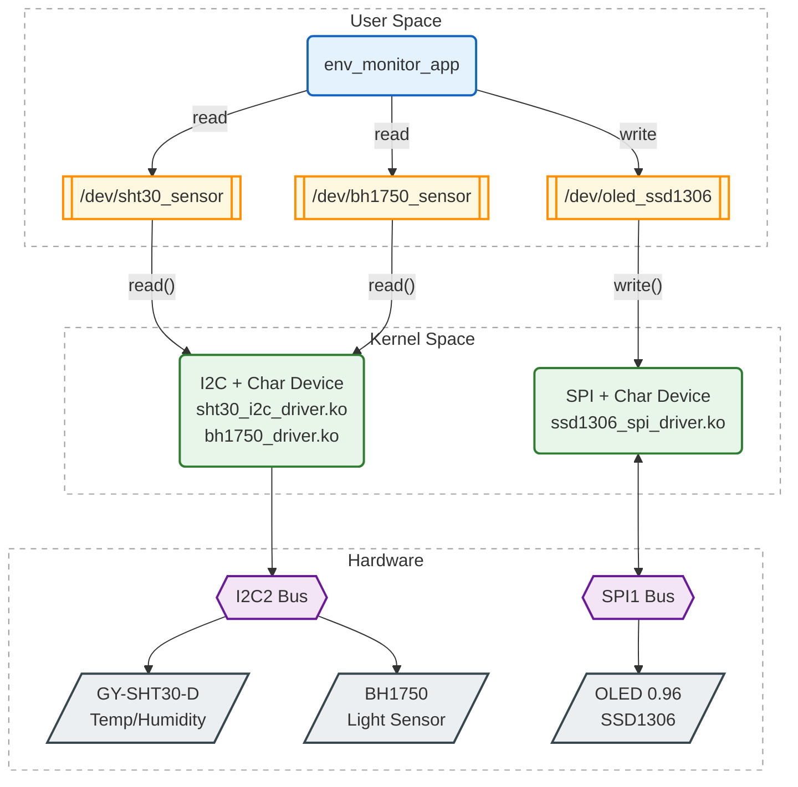

# Environmental Monitoring System

Environmental monitoring system for BeagleBone Black. All drivers are written from scratch — from Device Tree and kernel modules down to the user-space application — with zero vendor libraries or pre-built drivers.

## Architecture



## Project Structure

```
├── kernel_module_drivers/
│   ├── bh1750/                    # Light sensor driver (I2C)
│   │   ├── device_tree.txt
│   │   └── driver/bh1750_driver.c
│   ├── gy-sht30-d/                # Temp/humidity sensor driver (I2C)
│   │   ├── device_tree.txt
│   │   └── driver/sht30_i2c_driver.c
│   └── oled_sdd1306/              # OLED display driver (SPI)
│       ├── device_tree.txt
│       └── driver/ssd1306_spi_driver.c
└── app/
    ├── src/main.cpp               # User-space application
    └── Makefile
```

### Data Flow

1. User-space app reads sensors via `read()` on `/dev/sht30_sensor` and `/dev/bh1750_sensor`
2. Kernel I2C drivers fetch raw data from the I2C2 bus
3. App formats the readings and writes to `/dev/oled_ssd1306`
4. Kernel SPI driver sends pixel data to OLED via SPI1

## Hardware

| Component | Interface | Description |
|-----------|-----------|-------------|
| BH1750 | I2C | Digital light intensity sensor |
| GY-SHT30-D | I2C | Temperature and humidity sensor |
| SSD1306 | SPI | 128x64 OLED display |

**Platform**: BeagleBone Black (ARM Cortex-A8)

## Device Tree

Each driver includes a `device_tree.txt` with the required Device Tree overlay nodes. These must be added to the BeagleBone Black Device Tree before loading the drivers.

## Technical Highlights

### Kernel Space

- Custom character device drivers for I2C (BH1750, SHT30) and SPI (SSD1306)
- CRC8 validation for SHT30 communication
- Built-in 8x8 bitmap font and icon rendering on OLED
- Device Tree bindings for GPIO (DC/RESET) and bus configuration

### User Space

- Direct device file I/O (`open`/`read`/`write`)
- Polling-based sensor reading at 5-second intervals
- Signal handling for clean shutdown (SIGINT/SIGTERM)

## Notes

- Root privileges required for loading kernel modules and accessing device files
- I2C and SPI bus addresses must match your hardware setup
- OLED display supports bitmap icons (thermometer, humidity, light)
