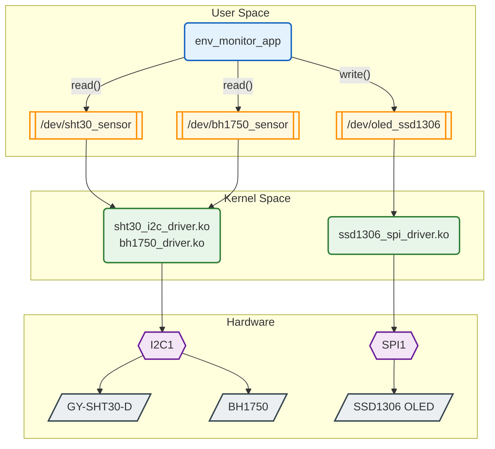

# Environmental Monitoring System

An environmental monitoring system for BeagleBone Black, with the entire stack written from scratch — Device Tree, kernel drivers, the user-space application, and the Yocto layer — no vendor libraries or pre-built drivers.

## Architecture



## From Device Tree to `/dev`

A device node only appears once this whole chain lines up:

| # | Step | Where |
|---|------|-------|
| 1 | Device Tree declares the node with `compatible = "haidoan,sht30"` | `am335x-boneblack.dts` |
| 2 | The `.ko` module is present in the rootfs | recipe, via `inherit module` |
| 3 | The module is loaded at boot | `KERNEL_MODULE_AUTOLOAD` |
| 4 | The kernel matches `compatible` against the driver's `of_match_table` | Driver Model |
| 5 | `probe()` calls `misc_register()`, creating `/dev/...` | inside the driver |

A break at step 1, 3, or 4 produces the **exact same symptom** — no device node, and the kernel reports no error at all.

## Data Flow

```
env_monitor_app (every 5 seconds)
  ├─ read("/dev/sht30_sensor")  → "25.6-68.3"
  ├─ read("/dev/bh1750_sensor") → "123.4"
  └─ write("/dev/oled_ssd1306", "25.6-68.3-123.4")
        └─ driver strsep()'s on '-' → draws 3 lines with icons on the OLED
```

App ↔ driver communication is plain text through the device file — `cat /dev/sht30_sensor` shows the reading directly, no app needed.

## Layout

```
meta-envmon/                            # Yocto layer
├── conf/layer.conf
├── recipes-kernel/
│   ├── linux/
│   │   ├── linux-yocto_%.bbappend      # injects the DT into am335x-boneblack.dts
│   │   └── files/*.dtsi                # I2C1 + SPI1 nodes and pinmux
│   ├── bh1750-driver/                  # one recipe + source per driver
│   ├── sht30-driver/
│   └── ssd1306-driver/
├── recipes-apps/env-monitor/
└── recipes-core/images/envmon-image.bb
```

## Kernel Drivers

All three drivers follow the same skeleton — matched to a device via the Device Tree, registering their node with `miscdevice`:

```c
static const struct of_device_id my_i2c_of_match[] = {
    { .compatible = "haidoan,bh1750" },   // matched against the Device Tree
    { }
};
MODULE_DEVICE_TABLE(of, my_i2c_of_match);
module_i2c_driver(bh1750_driver);
```

`miscdevice` is used instead of `alloc_chrdev_region` + `cdev_add` + `device_create`: registration collapses to a single `misc_register()` call, at the cost of only one minor number per registration — fine here since each sensor type has exactly one instance.

| Driver | Notable details |
|---|---|
| `sht30_i2c_driver.c` | CRC8 (polynomial `0x31`) validates the readout; conversion done in integer math (millidegree) since the kernel has no FPU |
| `bh1750_driver.c` | One-time H-resolution mode, `msleep(120)` for the conversion; returns lux × 10 to keep one decimal place |
| `ssd1306_spi_driver.c` | Draws directly over SPI, no framebuffer; hand-written 8x8 font and icons; DC/RESET pins come from the Device Tree |

Written for **kernel 6.6** — single-argument `probe()`, `void`-returning `remove()`.

## Device Tree

Each bus needs **two** parts: pinmux (selecting the mux mode for each pin) and the child device declaration.

```dts
&i2c1 {
    status = "okay";                    /* buses default to disabled */
    pinctrl-0 = <&i2c1_pins_sensors>;

    sht30@44 {
        compatible = "haidoan,sht30";   /* matched against the driver */
        reg = <0x44>;                   /* I2C address */
    };
};
```

The Device Tree is merged straight into `am335x-boneblack.dts` at kernel build time (no runtime `.dtbo` overlay), via `linux-yocto_%.bbappend`:

```bash
FILESEXTRAPATHS:prepend := "${THISDIR}/files:"
SRC_URI += "file://envmon-i2c1-sensors.dtsi file://envmon-spi1-oled.dtsi"

do_configure:prepend() {
    dts_dir="${S}/arch/arm/boot/dts/ti/omap"    # kernel 6.x moved TI's DTS here
    install -m 0644 ${WORKDIR}/*.dtsi ${dts_dir}/
    # append #include lines to the end of am335x-boneblack.dts
}
```

`FILESEXTRAPATHS:prepend` is required — without it, BitBake looks for the `.dtsi` files in the *original* recipe's directory inside `poky/` and won't find them.

## Yocto Layer

`meta-envmon` doesn't touch anything inside `poky/` — it only adds new recipes (`.bb`) and appends to existing ones (`.bbappend`).

| Part | Mechanism | Result |
|------|-----------|--------|
| Kernel module | `inherit module` | `.ko` → `/lib/modules/<ver>/extra/` |
| App | `do_install` + `${bindir}` | binary → `/usr/bin/` |
| Device Tree | `.bbappend` on `linux-yocto` | node merged into `am335x-boneblack.dts` before the kernel builds |

```bash
inherit module
SRC_URI = "file://Makefile file://bh1750_driver.c"
KERNEL_MODULE_AUTOLOAD += "bh1750_driver"    # load the module at boot
```

`module.bbclass` supplies `KERNEL_SRC` pointing at the built kernel, so the driver Makefile never hardcodes a kernel path.

Yocto **scarthgap** (5.0), `MACHINE = "beaglebone-yocto"`, kernel 6.6.

## Hardware

| Component | Interface | Pins |
|-----------|-----------|------|
| GY-SHT30-D | I2C1 `0x44` | P9_24 (SCL), P9_26 (SDA) |
| BH1750 | I2C1 `0x23` | P9_24 (SCL), P9_26 (SDA) |
| SSD1306 | SPI1 CS0 | P9_31 (SCLK), P9_30 (MOSI), P9_28 (CS) |
| └ DC / RESET | GPIO | P9_27 (DC), P9_25 (RESET) |

**Board:** BeagleBone Black (AM335x, ARM Cortex-A8)
